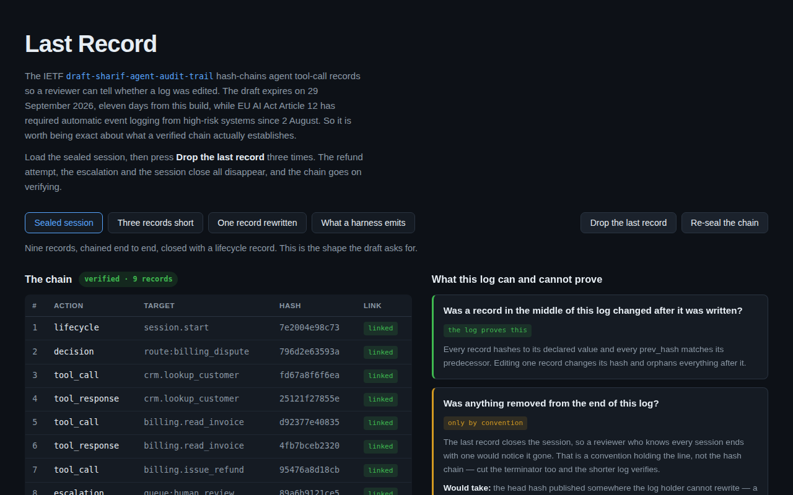

<div align="center">

# Last Record

**Cut the end off a hash-chained audit log and it still verifies.**

[](https://github.com/kbipul/last-record/actions/workflows/ci.yml)
[](https://kbipul.github.io/last-record/)

`Day 040` of **[kb-daily-builds](https://github.com/kbipul/kb-daily-builds)** — one AI project a day.

</div>

## What it does

The IETF draft `draft-sharif-agent-audit-trail` proposes a standard record format for what
autonomous agents do: twelve mandatory fields, seven action classifications, trust levels L0
through L4, and SHA-256 hash chaining over RFC 8785 canonical JSON so a reviewer can tell
whether a log was edited after the fact. The draft expires on 29 September 2026, eleven days
after this build, and EU AI Act Article 12 has required automatic event logging from high-risk
systems since 2 August. Both of those make the format worth understanding now.

This tool takes an agent tool-call log, checks each record against the draft's mandatory
fields, recomputes the hash chain, and then answers the question the green badge doesn't: what
does a verified chain actually establish? Load the sealed sample session, press **Drop the last
record** three times, and watch the refund attempt, the escalation and the session close vanish
from a log that goes on verifying perfectly.



<sub>The screenshot is captured by this repo's CI on a GitHub runner and committed back a few
minutes after publish — the build sandbox has no browser to take one.</sub>

## Try it

**[Live demo →](https://kbipul.github.io/last-record/)** — runs fully in your browser, nothing
to install.

```bash
git clone https://github.com/kbipul/last-record.git
cd last-record
npm ci
npm test          # 52 tests
npm run dev       # http://localhost:5173/last-record/
```

## How it works

Three decisions shaped the code.

Hashing is synchronous. `crypto.subtle.digest` is async, so using it would have turned every
record hash into a promise and every keystroke in the log editor into a race. SHA-256 is written
out in `src/aat/sha256.ts` instead, checked against five NIST vectors including the
million-character one. That also means the test suite runs in plain Node with no DOM and no
polyfill, which matters when the thing under test is the verifier itself.

Links are checked against recomputed hashes rather than declared ones. Each record carries a
`prev_hash`, and a verifier can compare it either to the predecessor's `record_hash` field or to
what the predecessor actually hashes to. Only the second choice makes an edit cascade. See the
build notes for how I found that out.

Provability lives in its own module. `src/aat/provable.ts` takes the chain report and returns
five claims, each with a verdict of `proved`, `conditional` or `unprovable` and a line saying
what would move it up. Keeping it out of `chain.ts` is deliberate: "the chain verifies" and "this
log is complete" are different statements, and the whole project exists to hold them apart.

```
log text ──parse──▶ records ──┬──▶ conformance.ts ──▶ missing fields, bad enums
                              │
                              ├──▶ chain.ts ────────▶ per-record link status, head
                              │                            │
                              └────────────────────────────┴──▶ provable.ts ──▶ 5 verdicts
```

The five claims, for the sealed sample:

| Question | Verdict |
|---|---|
| Was a record in the middle changed after it was written? | the log proves this |
| Was anything removed from the end? | only by convention |
| Is every action the agent took in here? | the log cannot say |
| Could whoever holds this log have produced it themselves? | the log cannot say |
| Did these actions happen when the timestamps say? | the log cannot say |

## Build notes — what I learned

The spec was unreachable for the entire build. `datatracker.ietf.org` served
"This site is currently being upgraded. We'll be back shortly!" on every attempt, so I never
read the draft text. The field set in `src/aat/schema.ts` is reconstructed from secondary
descriptions: twelve mandatory fields, the seven classifications, L0–L4, SHA-256 over RFC 8785.
The classifications, the level range and the chaining construction are attested by more than one
source. The exact spelling of `input_hash` versus `inputHash` is not, and a conformance checker
whose field names are guesses will happily fail a conforming log. So the reconstruction is
declared in the code, exported as `RULESET_PROVENANCE`, and rendered at the bottom of the
conformance panel rather than tucked into a comment. If you are checking a real log against the
real draft, read the draft.

A test then caught the bug the project is about. `orphans every record after a rewritten one`
failed with `expected 'ok' to be 'link_broken'`. The middle-edit sample changes one record's
`action_target` after sealing; record 5's `prev_hash` still matched record 4's *declared*
`record_hash`, because that field was never touched. My verifier compared against the declared
value, so it flagged one bad record and passed everything after it. Chaining on the recomputed
hash is what makes tampering spread. That is a one-line difference and the difference between a
chain and a list of unrelated checksums — I had written the weaker one without noticing, in a
project whose entire subject is being precise about what verification proves.

Signature verification was cut for time. The `authorship` claim checks whether every record
carries a `signature` field and upgrades its verdict if so. It does not verify the signature. Doing it
properly needs ECDSA over P-256, key distribution, and a decision about what a key even means
when the agent, the harness and the platform are three different parties — an afternoon on its
own, and it would have pushed this past the session budget. The claim text says "carry a
signature", not "are validly signed", and the gap is named here rather than papered over.

The canonicalizer has a similar honest edge. `canonical.ts` implements RFC 8785's key sorting,
whitespace rules and string escaping, but not section 3.2.2.3's number serialisation, which
wants ECMAScript shortest-round-trip form for non-integers. Audit records carry no floats, so
nothing in the samples hits it. A record that did would canonicalise differently under a
conforming implementation and its hash would not match.

What stayed with me is how ordinary the truncation case looks. The broken-chain sample is
obviously wrong: a red row, an orphaned tail, a badge reading `breaks at record 5`. The
truncated one is indistinguishable from a clean short session. Same badge, same green rows, a
different head hash that nothing anywhere contradicts. A hash chain is a backwards-pointing
structure and no record in it knows how many should follow, so the honest version of "tamper-
evident" is "evident against edits, silent about deletions from the end." Publishing the head
somewhere the log holder cannot rewrite is what closes that, and almost nobody does it.

## Stack

| Layer | Choice |
|---|---|
| UI | React 18, TypeScript 5 |
| Build | Vite 5 |
| Tests | Vitest 2 — 52 tests, Node environment |
| Crypto | SHA-256 implemented in `src/aat/sha256.ts`, NIST vectors in `sha256.test.ts` |
| Dependencies at runtime | react, react-dom |

---

<div align="center"><sub>
Built by <a href="https://www.kumarbipul.com"><b>Kumar Bipul</b></a> ·
IT Director → AI/ML · <a href="https://github.com/kbipul">github.com/kbipul</a>
</sub></div>
